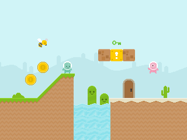
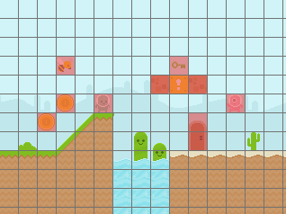

# Desafío #1: Pintar la escena

Utilizando las imágenes que acompañan al ejemplo, agregar los sprites necesarios para armar (más o menos) la escena de la imagen

A modo de ayuda, el ejemplo contiene algunos sprites ya agregados.

También puede utilizarse la imagen  a modo de guía para ubicar los sprites. El tamaño de cada celda de la grilla es de 21 px. 